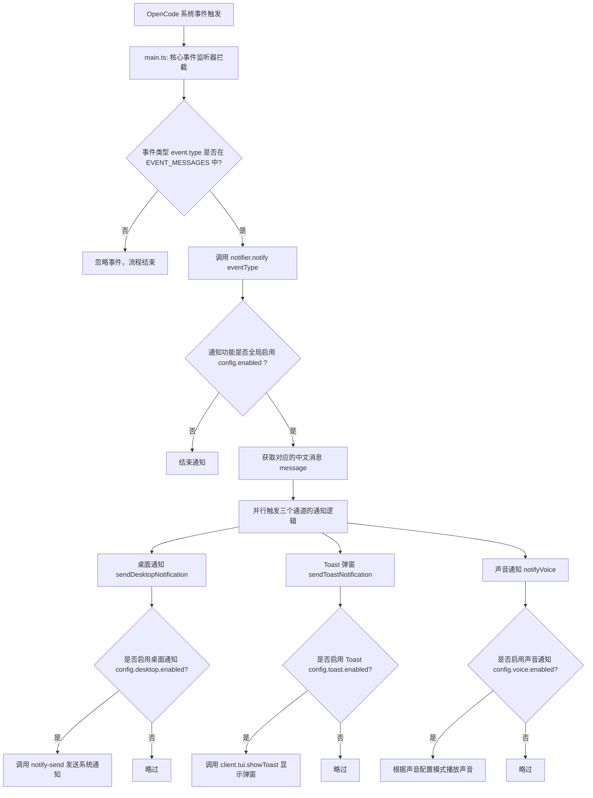
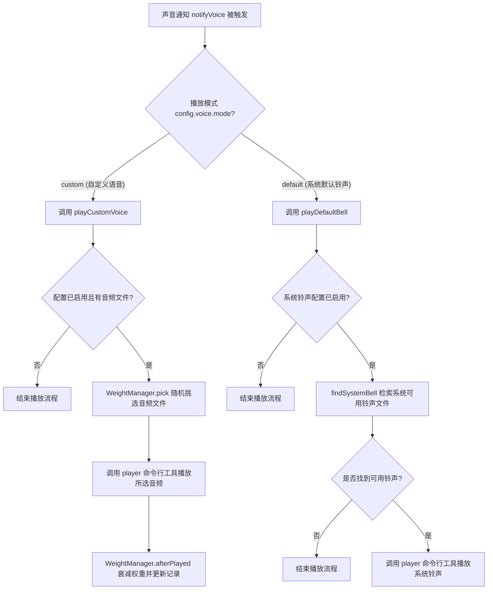

# OpenCode 通知插件源码结构与流程说明

本目录（`src/`）包含 OpenCode 通知插件的核心实现逻辑。该插件主要负责监听 OpenCode 的系统事件（如任务完成、出错或权限申请），并以**桌面系统通知**、**编辑器内 Toast 弹窗**和**声音/自定义语音播放**的方式对用户进行提醒。

---

## 目录结构说明

* [constants.ts](file:///home/duoyun/idea/idea/opencode-notification/src/constants.ts)：定义了各事件状态提示词、支持的音频格式、Linux 内置铃声查找白名单路径以及默认配置。
* [types.ts](file:///home/duoyun/idea/idea/opencode-notification/src/types.ts)：声明了插件的配置接口定义。
* [utils.ts](file:///home/duoyun/idea/idea/opencode-notification/src/utils.ts)：提供通用工具函数，如加载和解析配置文件（支持 `.jsonc` 和 `.json`），当解析出错时自动进行默认值降级。
* [notifier.ts](file:///home/duoyun/idea/idea/opencode-notification/src/notifier.ts)：通知器的分发中心，实现多通道（Desktop, Toast, Voice）通知的触发逻辑。
* [sound.ts](file:///home/duoyun/idea/idea/opencode-notification/src/sound.ts)：声音通知实现，支持 Linux 默认系统铃声的路径探测与播放，以及自定义语音目录的挂载。
* [weight-manager.ts](file:///home/duoyun/idea/idea/opencode-notification/src/weight-manager.ts)：自定义语音播放列表的权重控制器。负责轮询、去重以及音频权重的衰减，防止同一首提示音被连续重复播放。

---

## 核心业务逻辑流程图

### 1. 整体通知触发流程

当 OpenCode 触发系统事件时，插件的通知分发链路如下：



---

### 2. 声音通知播放决策流程

对于声音提醒通道，插件会根据配置的模式（系统铃声 `default` 或自定义语音 `custom`）执行不同的播放策略：



---

### 3. 音效权重管理机制（针对自定义语音模式）

为了确保自定义目录下的音乐播放更加丰富且分布均匀，[WeightManager](file:///home/duoyun/idea/idea/opencode-notification/src/weight-manager.ts#L5) 采用权重轮询调度机制：

```mermaid
graph TD
    A[WeightManager 初始化] --> B[扫描音乐目录，获取音频列表]
    B --> C{本地是否存在 .weights.json 缓存?}
    C -- 是 --> D[加载上次保存的权重和已播放文件列表]
    C -- 否 --> E[初始化所有音频文件权重为默认值 100]
    
    F[调用 pick() 随机挑选音频] --> G[计算当前全部文件的权重之和 totalWeight]
    G --> H{totalWeight <= 0?}
    H -- 是 --> I[调用 initWeights() 重置所有权重为 100]
    I --> G
    H -- 否 --> J[在 0, totalWeight 之间取随机数]
    J --> K[按权重区间扣减，命中的音频文件将被返回]
    
    L[播放完毕，调用 afterPlayed()] --> M[当前文件权重乘以衰减因子 decayFactor]
    M --> N[将当前文件加入已播放集合 played]
    N --> O{played 集合大小 >= 音频文件总数?}
    O -- 是 --> P[调用 initWeights() 重置所有文件权重为 100]
    O -- 否 --> Q[保存最新的权重到 .weights.json]
```
